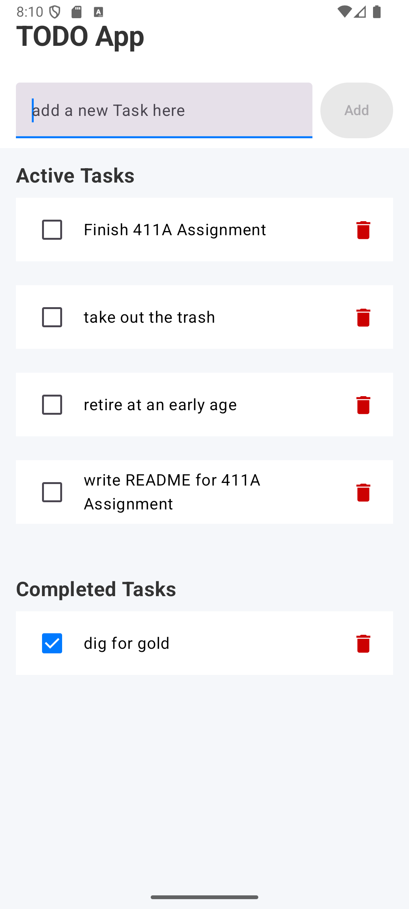

# Todo App

This is a simple Todo app that allows you to create and track your todo's all in one screen.

Each task is stored as a data class with only 3 fields: `id`, `description`, and `isCompleted`.

The state of the app consists mainly of the tasks in the `taskList` variable declared with the `MutableStateListOf` function. The input field at the top of the app is also a part of the state, and the text there is declared with `MutableStateOf`.

The `ToDoApp` function acts as the parent that keeps track of the app's state. The app's data flows down into individual `TaskItem` objects that send state data back up to the parent function when the user interacts with them(via the checkbox and delete buttons).

## Screenshots

### First look at app with sample tasks

### Writing out a new task before adding to list

### Adding the new task to list

### Checking off a task sends it to the completed list

### If lists are empty, messages let you know

